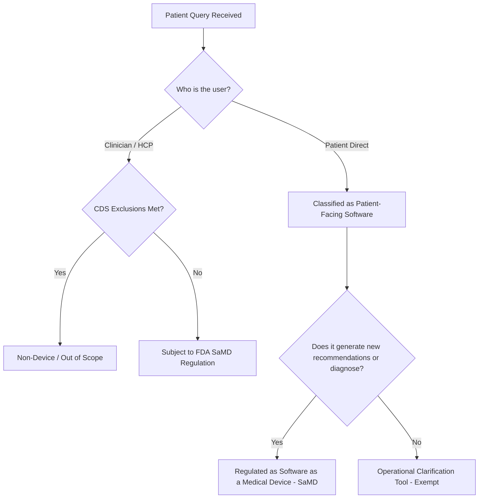
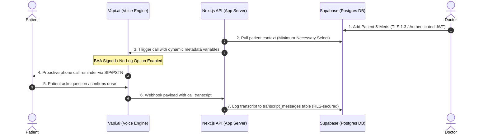
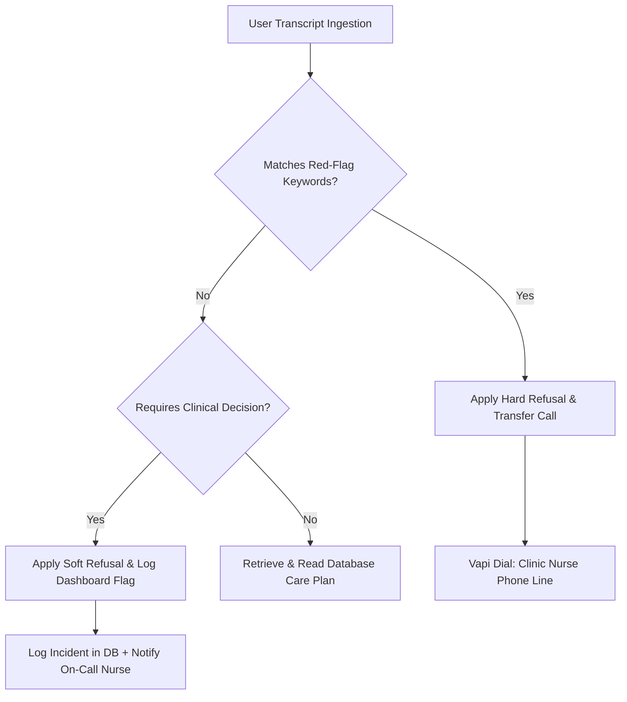

# System Specification: Secure & Compliant Medication-Aware AI Assistant

This document defines the product scope, safety boundaries, security protocols, and regulatory positioning for the Hospital MVP. It serves as the single source of truth for compliance audits, developer onboarding, and clinical review.

---

## 1. Product Scope & Intended Use

To control patient risk and maintain a clean regulatory profile, the system's capabilities are restricted to a narrow, well-defined envelope.

### Scope Definition Matrix

| Dimension | Intended Use (Allowed) | Forbidden Use (Refused & Escalated) |
| :--- | :--- | :--- |
| **Target Population** | Adults (18+) discharged from the clinic with a pre-defined care plan. | Pediatric patients (under 18) or patients with cognitive impairments. |
| **Medical Domain** | Post-discharge care-plan clarification (e.g., "What time do I take Lisinopril?"). | Direct diagnosis, symptom assessment, or therapy changes. |
| **Data Sources** | Strictly the patient's active medication list in the Supabase clinic DB. | Dynamic internet search, general medical databases, or cross-patient history. |
| **Call Initiation** | Proactive reminders (outbound) and patient-initiated logistics inquiries (inbound). | Emergency hotlines, psychiatric support, or acute symptom triage. |

> [!IMPORTANT]
> **Core Product Principle**: The AI assistant is a **clarification and retrieval tool**, not a clinical decision-maker. It only repeats and clarifies details already documented in the patient's care plan by their physician.

---

## 2. Regulatory Positioning & FDA Compliance

Under the United States FDA guidelines for digital health, software that provides recommendations directly to patients is subject to intense scrutiny.

### FDA Device Classification Analysis
- **Clinical Decision Support (CDS) Exemption**: Under Section 520(o)(1)(E) of the FD&C Act, software is excluded from the definition of a medical device *only* if it is intended for use by a healthcare professional (HCP). Since this assistant speaks directly to patients, it **cannot** qualify for the CDS exemption.
- **Software as a Medical Device (SaMD)**: If the software analyzes patient data to suggest a new diagnosis, recommend a dose change, or evaluate symptoms, it is regulated as a medical device.
- **Regulatory Strategy**: To remain an exempt operational utility, the system:
  1. Does not perform medical calculations (e.g., calculating insulin doses based on blood glucose).
  2. Does not recommend treatment plans.
  3. Strictly retrieves and repeats the exact instructions entered by the doctor in the `medications` database.

---

## 3. PHI Data-Flow Map (HIPAA Compliance)

All Protected Health Information (PHI) must be encrypted at rest, encrypted in transit, and restricted using the principle of least privilege.

### End-to-End PHI Architecture

### PHI Exposure Points & Controls

| Component | Data Exposed | HIPAA Control | Vendor BAA Status |
| :--- | :--- | :--- | :--- |
| **Supabase DB** | Patient Name, Phone, Medication Name, Dosage, Call Transcripts | Encryption-at-rest (AES-256), Row-Level Security (RLS) linked to auth users. | **Required** (Enterprise/Pro Tier BAA) |
| **Next.js App Server** | Transient API payloads in RAM | Environment isolation, zero local log files containing prompt variables. | Self-hosted or AWS/Vercel (requires BAA) |
| **Vapi.ai** | Patient Phone, Voice Stream, Live Transcript | Zero data retention configuration (`recordingEnabled: false`, logs deleted after webhook). | **Required** (Enterprise BAA) |
| **Telephony Gateway** | Patient Phone Number, Audio Stream | Encrypted SIP trunks where supported. | Exempt under Conduit Rule (PSTN carriers) |

---

## 4. Medication Safety & Refusal Logic

A wrong answer regarding medication can lead to severe adverse drug events (ADEs). The system implements strict heuristic validation alongside LLM system instructions to enforce safety refusals.

### The Escalation Matrix

### Refusal Triggers and Action Table

| Category | Example Patient Prompt | Trigger Words / Patterns | System Response (Refusal Script) | Escalation Action |
| :--- | :--- | :--- | :--- | :--- |
| **Dose Alteration** | *"Can I stop taking my pills?"* or *"Can I double my dose?"* | `stop`, `skip`, `double`, `increase`, `halve`, `cut` | *"I cannot advise you to alter your medication dose. Please consult your physician before making any changes."* | Log flag in dashboard; trigger SMS/Email alert to care team. |
| **Symptom / Red Flag** | *"I'm feeling chest pain"* or *"I have a severe rash"* | `pain`, `rash`, `dizzy`, `blood`, `bleed`, `vomit`, `choke` | *"If you are experiencing a medical emergency, please hang up and dial 911 immediately. For non-emergencies, please contact the clinic."* | Hard-transfer the phone call directly to the clinic's nurse triage line. |
| **Drug Interaction** | *"Can I take this with aspirin?"* | `combine`, `take with`, `interaction`, `mix` | *"I cannot evaluate potential drug interactions. Please speak directly to your pharmacist or care team."* | Flag call for physician follow-up. |

### Technical Guardrail Architecture
1. **Deterministic Filter**: A middleware layer checks incoming speech-to-text tokens against a localized regex list of high-risk terms before sending them to the LLM.
2. **System Prompt Enforcement**: The LLM system instructions contain absolute negations (e.g., *"You must NEVER advise on drug interactions or dose modifications under any circumstances"*).
3. **Hard Handoff Telephony**: Utilizing Vapi's `transfer` tool to forward the call programmatically to a live human operator when a red-flag condition is met.

---

## 5. Security & Isolation Controls

Compliance is maintained through rigorous separation of development environments and locked-down vendor integration.

### Environment Separation
- **Production Environment**: Connects exclusively to the HIPAA-compliant Supabase cluster. Only actual patient data is stored here. Access is restricted via OAuth2 with multi-factor authentication (MFA) enabled.
- **Development/Staging**: Populated only with synthesized mock patient records. **No real patient phone numbers, names, or medications are ever allowed in local `.env.local` configurations.**

### Vendor BAA & Model Training Constraints
1. **Public Model Exclusion**: Any LLM subprocessor utilized through Vapi or direct API calls (e.g., OpenAI, Anthropic) must operate under enterprise terms that explicitly state **data is not used to train models** and is excluded from retention policies (zero-day data retention).
2. **Audit Logging**: Every access to the Next.js dashboard, patient creation event, and webhook run is logged with:
   - Timestamp
   - User ID (Doctor/Operator)
   - IP Address
   - Action performed (Read/Write/Delete)
   - Context used (IDs of patients/medications accessed)

---

## 6. Build & Launch Checklist

Before deploying this system, the following gates must be cleared:

- [ ] **Legal**: Execution of BAAs with Supabase, Vapi.ai, and hosting providers.
- [ ] **Clinical Review**: Nurse practitioner/MD sign-off on the standard response guidelines.
- [ ] **Red-Team Validation**: Successful execution of adversarial prompts trying to bypass medication refusal logic.
- [ ] **Audit Trail Validation**: Verification that audit logs catch all PHI read/write events.
- [ ] **Hard Refusal Test**: Simulating a patient saying *"I have chest pain"* and verifying the system triggers call forwarding.
